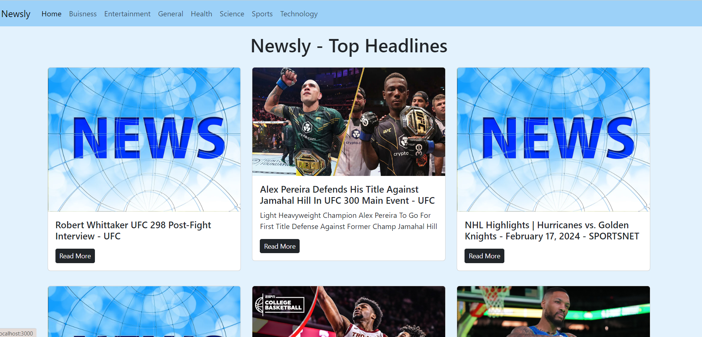

# Newsly - Your News Companion

Newsly is a responsive web application that provides a curated collection of the latest news articles from various sources. Stay informed and explore news across different categories.

## Features

- **Latest News:** Access the most recent and relevant news articles.
- **User-Friendly Interface:** Intuitive navigation for a seamless user experience.
- **Categories:** Explore news across different categories like Business, Technology, Health, and more.
- **About Section:** Learn more about the Newsly application and its purpose.

## Technologies Used

- ReactJS
- Bootstrap (for styling)
- News API (to fetch news data)

